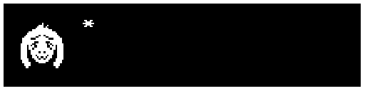
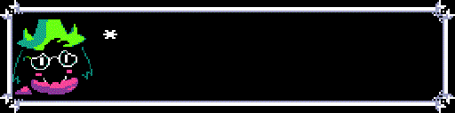
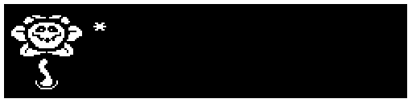

# undertale-dialogue-generator
Generate GIFs and pictures with Undertale/Deltarune dialogues





# How-to
## Installation
At first, you'll need to install **pillow**, not **PIL**:
```pip3 install PIL```
## Using
There are four methods that you can use:
### createundertaledialog(face,hoffset,fnt,phrase,style)
#### face - string with the path to the face file
#### hoffset - horizontal offset for correct drawing of face, I reccomend you using **8**
#### fnt - font, that is determined in code, so it's better to set path in code first
#### phrase - string, that will be shown on picture
#### style - string, send "deltarune" if you want Deltarune border, otherwise set to anything else like "undertale"
#### This function will return Image object, that you can use with pillow
### dialoganim(faces,hoffset,fnt,phrase,style)
#### faces - list with faces that will be changing while talking
#### fnt - font, that is determined in code, so it's better to set path in code first
#### phrase - string, that will be shown on picture
#### style - string, send "deltarune" if you want Deltarune border, otherwise set to anything else like "undertale"
#### This function will return list of frames, that you can use with gifsave function
### gifsave(wholeanim,dur,saveto)
#### wholeanim - whole animation, you can send only list with frames from one call of dialoganim or you can merge more of them with "+"
#### dur - duration of frame, I recommend using 75
#### saveto - destination file
### strtolist(string)
#### Little function to transform string into list for using in dialoganim
#### string - String to transform
#### This function returns list

# Links
##### 
#####  (little note: it's better to use 90x96 faces)
###### UNDERTALE and DELTARUNE are trademarks of Toby Fox
